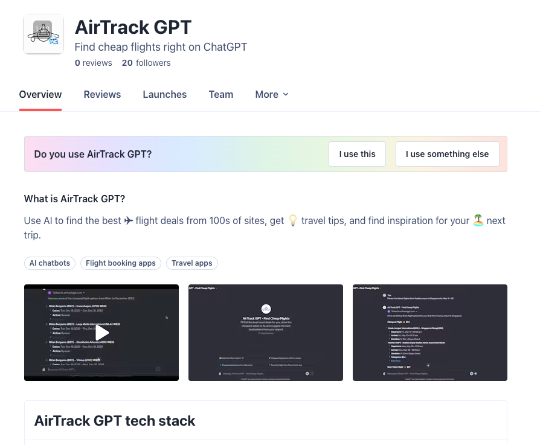
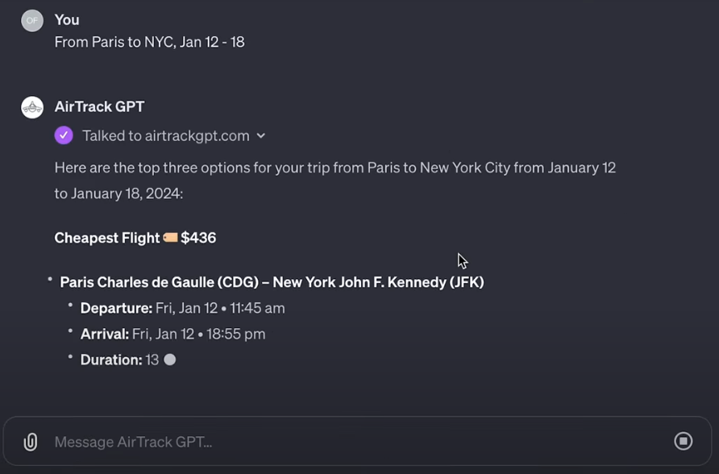
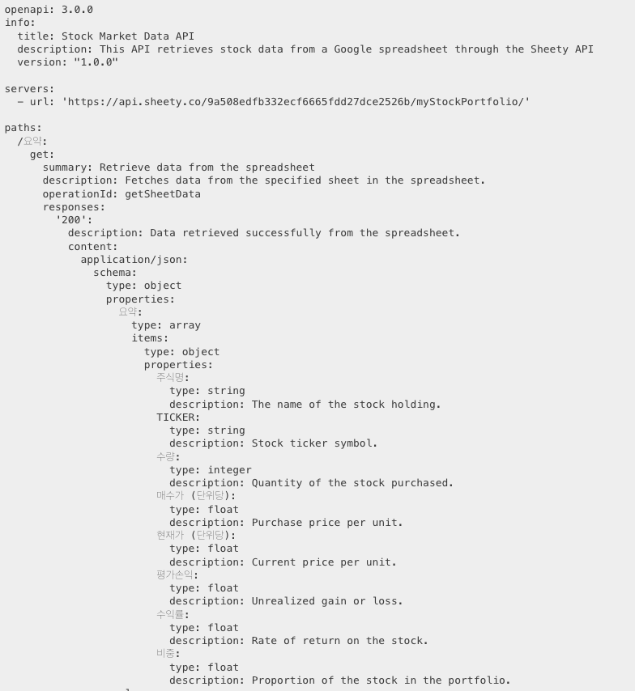

# GPTs 활용법 (✈️ 항공권 특가 알림 서비스)
- +GPTs 무한한 가능성
---

# 항공권 특가 알림 서비스 

Pain Point : 
- 저렴한 항공편을 찾기 위해서 매일 웹사이트를 수동으로 확인
- 많은 시간이 걸림
- 가격 모니터링은 귀찮다.

---

사용자수 : 백만 명+  
- 월별 항공편 검색 건 : 450,000건+
- 가격 알림 : 매월 1,500,000건+ 
- 클라이언트 : 텔레그램 봇  
- 추정수익 월 $84,000 

---

---

---

# GPTs가 뭔가요? 

## 특정 요구사항을 전문적으로 수행하는 커스터 마이징 된 ChatGPT

- AirTrack GPT
- SEO Blog GPT
- 회고록 GPT
- ...

---

# + 추가 기능  

+ DALL-E 이미지 생성 기능 
+ Bing 웹 브라우징 
+ 코드 인터프리터 
+ Extra knowledge : 직접 DB 데이터 제공 
+ Actions : 내 서비스의 API로 데이터를 제공

---

# Actions > AirTrack GPT

- GPTs에서 요구하는 데이터를 제공
- 나의 서버 API -> GPT
- OpenAPI - JSON Schema

---

# 정해진 Spec 따라 만들면 된다. 

---

# 

---

# 개인적으로 생각하는 GPTs의 미래

1. 구글 검색? GPTs 한테 물어보는게 더 좋아

2. SEO 대신 GPTs 에 집중한다.   

3. >반복

---

# 끝

---

# 끝

---

# 끝
