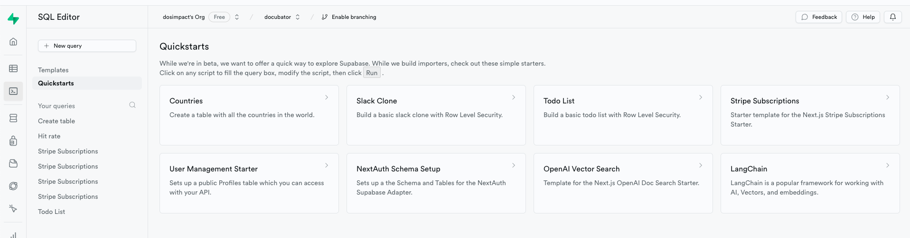
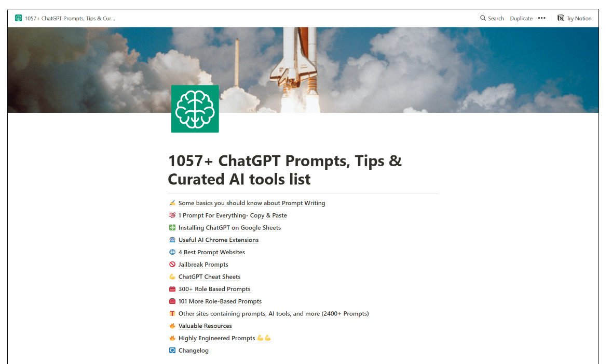

# 🍋 월 3천만원 버는 AI서비스 무료로 개발하는 방법
- 부제 : Headlime 클론

---

# GPT API를 사용한 서비스가 엄청난 돈을 쓸어 담고있다.  

## 한국에는 그 물결이 아직 왔는가?..

## 해외의 사례를 탐구 & 어떻게 만들까?

--- 


---

# AI 카피라이팅 

## 카피란? 


## 왜 돈이되는가?

---

# 🙏 기술의 난이도가 많이 어려운가요..?


- 로그인 기능(Google) : superbase, firebase의 사용법
- 결제 및 구독 기능 : 3rd-party 연동방법
- GPT API 연동
- 카피 문구 생성 프롬프트 : 사실 이부분이 핵심 노하우겠네요.
- 다양한 카피 생성 템플릿

---

# 1.기술 스택

## Youtube를 돌아다니며 배울 수 있는 무료 강의들이 많습니다.


---

# 2.아래와 같은 기술 스택을 잘 배웠다고 가정

NextJS : 웹서비스와 API서버를 담당합니다.  
- TailwindCSS : 빠르게 웹 디자인을 구축합니다.  
- Radix UI : 재사용가능한 UI컴포넌트들이 있어요.  
- Zustand : 전역상태관리가 가능합니다.   

Superbase : FireBase의 SQL 버전이라고 생각하면 됩니다.!  
- OAuth : 사용지 인증, 인가 관리 
- User Table : 사용자 및 카피라이팅 서비스 관리 
- Stripe Table : 결제 관리
- GPT Prompte Template Table : 다양한 카피문구 생성 템플릿 관리  

Stripe : 3rd-party 결제 시스템  

---


---

# Superbase

- Superbase에는 Table 설계에 필요한 DDL 템플릿
- Web Admin Tool에서 빠르게 데이터 베이스 모델링이 가능합니다.

저희는 비즈니스 모델에 관련된 Table설계에만 집중할 수 있어요. 😮

---



---
# GPT + Prompt Template 작업은?? 


---

## Pain x Gain x Claim 프롬프트(핵심)

## 언어, 창의성, 목소리 톤, 청중

## 상품명, 제품 설명

---

```

  response = openai.ChatCompletion.create(

    model="gpt-3.5-turbo",

    messages=[

          {"role": "system", "content": "너는 이제부터 영어로 대답해"}, # 언어와 연결

          {"role": "system", "content": "너는 전문적인 톤으로 말해"}, # 목소리 톤과 연결

          {"role": "system", "content": "너의 청중들은 Developer 이야 "}, # 청중과 연결

          {"role": "user", "content": "아래의 상품명,제품설명을 기반하여... 고객이 고통,얻는것... 을 생성해 "}, # Pain x Gain x Claim 공식에 맞는 카피 생성 프롬프트

          {"role": "user", "content": "상품명은 OOO이야"}, # 상품명

          {"role": "user", "content": "제품설명은 OOO이야"}, # 제품 설명

      ],

    temperature=1 # 창의성과 연결, 0에 가까울수록 매번 다른 응답이 온다.  

  )

```
---
# 프롬프트 잘 짜는것도 귀찮은데...



## US$15


---

# 코딩보다 중요한거 ?

## 100% 클론코딩 (카피) != 성공 

---
# 수많은 실패


## "PMF" 찾는 여정

---
# 정말 필요한 서비스를 만들었다면 ? 

최초의 서비스 :  AI를 활용 X
- 그냥 하나의 문장에서 단어만 바꿀 수 있도록 `문자열 템플릿`을 만들었습니다.

그럼에도 200여개의 카피 문구 template 기능만으로

- 한 달 안에 500여 명의 결제 고객
- 7천만 원 이상의 수익

---

# 개발보다 더 중요한 사항

## 코딩은 3순위 (혹은 n순위)

## 수익을 위해서는 더 중요한 2가지가 있습니다.

1. 정말로 고객이 원하는 서비스를 발굴하는 인사이트

2. 그 문제를 해결할 수 있는 증명된 실력과 노하우

3. 이후 코딩으로 자동화


---

# 끝

---

# 끝

---

# 끝
